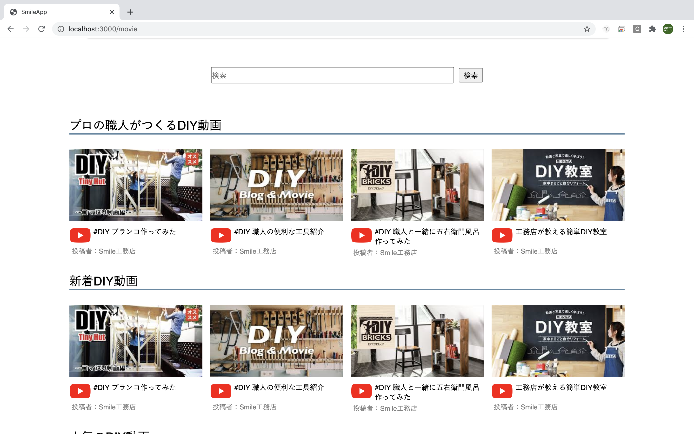
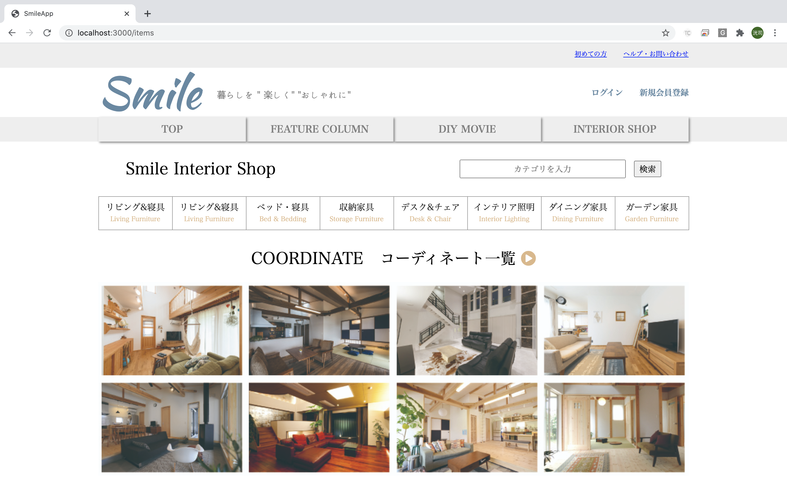

# README

# アプリ名
住宅情報アプリ 「Smile」 

# 概要
* ハウジングイベントの閲覧、登録店のみ投稿・編集・削除
* 特集記事の閲覧 
* DIY動画の閲覧、登録店のみ投稿・編集・削除 (フロントのみ・サーバー未実装)
* インテリアのネットショッピング、登録店のみ出品 (フロントのみ・サーバー未実装)

# 本番環境(デプロイ先 テストアカウント＆ID)
* IPアドレス / http://54.168.11.33/
* basic認証 / ユーザー名:'smile' 、パスワード:'2020'
* テストアカウント / ユーザー名:'test' 、パスワード:'test1111'

# 制作背景(意図)
## ・前職での経験を参考にアプリを設計しました。

前職で発行していた住宅情報誌では年4回の季刊誌であったため、イベントや見学会等のタイムリーな情報を発信することができませんでした。ネット媒体の良さであるタイムリーな情報を発信することができるアプリです。

## ・住宅のイベント情報だけでなく、暮らしを楽しくするコンテンツを追加
一度家を購入してしまえば、しばらくは住宅イベント情報は不要となってしまいます。登録者・利用者数の減少を防ぐ為、暮らしを楽しむ住宅情報アプリとして下記のコンテンツを追加しました。

1. インテリアのネットショッピング 
2. 特集記事
3. DIY動画のリンクサイト

# DEMO
## 工夫したポイント
## ・運営側の負担を軽減
イベント情報の投稿では、原稿制作や校正など運営側の負担を軽減するため、登録店が自らフォーマット形式で投稿することができます。

https://gyazo.com/e9bd1e038fd7c6f62680ddfcfe570e47
https://gyazo.com/45aaa8b14c0c7a56451a9daee24cb619

## ・動画使った企業PR
DIY動画では、アプリの利用者が楽しめるだけでなく、動画を通じて、工務店の得意とする技術やコンセプトを伝えれる場としての活用も目的としています。また、新規獲得のきっかけの1つとなるよう、DIY動画から企業の作業員や雰囲気を伝えることもできます。

## ・インテリアのネットショップで収益・利用者数のUP
インテリアは家の購入前後でも常に必要な情報であるため、登録者数や利用者数アップのコンテンツとして追加。また、実際にDIY動画で製作した家具なども購入可能にすることで地球に優しいリサイクル♪

https://gyazo.com/2aceea8cbca8c140b178fb143bdd0647

## ・アプリの収益のイメージ
アプリの規模としては、利用者数80万人が目標です。
※愛知県三河地方(人口240万人)・静岡県浜松市(人口80万人) 総人口320万人。

* 利用者80万人の広告媒体
* ハウジングイベントや会社情報の掲載料
* 家具の販売手数料
* DIY動画の動画制作

## 使用技術(開発環境)
* Ruby
* Ruby on Rails
* MySQL
* Github
* AWS
* Visual Studio Code

## 課題や今後実装したい機能
* ネット予約システム
* ユーザーの位置情報からハウジングイベント表示順を変更
* 各コンテンツ登録者のみの投稿・編集・削除

# DB設計
## userテーブル
|Column|Type|Option|
|------|----|------|
|nick_name|string|null: false,unique:true|
|email|string|null: false,unique:true|
|password|string|null: false,unique:true|
|first_name|string|null: false|
|last_name|string|null: false|
|first_name_kana|string|null: false|
|last_name_kana|string|null: false|
|birthday|date|null: false|
### Association
- has_one :address, dependent: :delete
- has_many :item, dependent: :delete_all
- has_many :event, dependent: :delete_all
- has_many :move, dependent: :delete_all
- has_many :message, dependent: :delete_all

## addressテーブル
|Column|Type|Option|
|------|----|------|
|prefecture_id|integer|null:false|
|city|string|null:false|
|town|string|null:false|
|building|string||
|phone_number|string|null:false|
|user_id|integer|null:false,foreign_key:true|

## Association
- belongs_to:user
- belongs_to_active_hash :prefecture

## eventsテーブル
|Column|Type|Option|
|------|----|------|
|company_name|string|null:false|
|c_phone_num|string|null:false|
|genre|string|null:false|
|day|string|null:false|
|title|string|null:false|
|place|string|null:false|
|time|string|null:false|
|parking|string|null:false|
|e_phone_num|string|null:false|
|point_1|text|null:false|
|point_2|text|null:false|
|point_3|text|null:false|
|data_family|string|null:false|
|data_floor_plan|string|null:false|
|data_site_area|string|null:false|
|data_total_area|string|null:false|
|url_link_c|string|null:false|
|url_link_f|string|null:false|
|url_link_i|string|null:false|
|user_id|integer|null:false,foreign_key:true|

## Association
- belongs_to :user, optional: true
- has_many :event_images, dependent: :delete_all
- accepts_nested_attributes_for :event_images, allow_destroy: true

## event_imagesテーブル
|Column|Type|Option|
|------|----|------|
|image|string|null:false|
|event|references|null:false,foreign_key:true|

## Association
- belongs_to :event, optional: true

## movesテーブル
|Column|Type|Option|
|------|----|------|
|title|string|null:false|
|imege|string|null:false|
|url|string|null:false|
|user_id|integer|null:false,foreign_key:true|

## Association
- belongs_to :user, optional: true

## articlesテーブル
|Column|Type|Option|
|------|----|------|
|catch_copy|string|null:false|
|lead_paragraph|text|null:false|
|main_text|text|null:false|
|production_data|text|null:false|

## Association
- has_many :article_image, dependent: :delete_all

## article_imagesテーブル
|Column|Type|Option|
|------|----|------|
|top_image|string|null:false|
|main_image|string|null:false|
|sub_image_1|string|null:false|
|sub_image_2|string|null:false|
|sub_image_3|string|null:false|
|article|references|null:false,foreign_key:true|

## Association
- belongs_to :article, optional: true

## itemsテーブル
|Column|Type|Option|
|------|----|------|
|name|string|null:false|
|price|string|null:false|
|user_id|integer|null:false,foreign_key:true|

## Association
- belongs_to :user, optional: true
- belongs_to :category, optional: true
- has_many :item_image, dependent: :delete_all

## item_imagesテーブル
|Column|Type|Option|
|------|----|------|
|image|string|null:false|
|item|references|null:false,foreign_key:true|

## Association
- belongs_to :item

## categoriesテーブル
|Column|Type|Option|
|------|----|------|
|name|string|null:false|

## Association
- has_many :item

## cardsテーブル
|Column|Type|Option|
|------|----|------|
|customer_id|string|null:false|
|card_id|string|null:false|
|user_id|integer|null:false,foreign_key:true|

## Association
- 

## messagesテーブル
|Column|Type|Option|
|------|----|------|
|content|string|null:false|
|user_id|integer|null:false,foreign_key:true|

## Association
- belongs_to :user, optional: true
